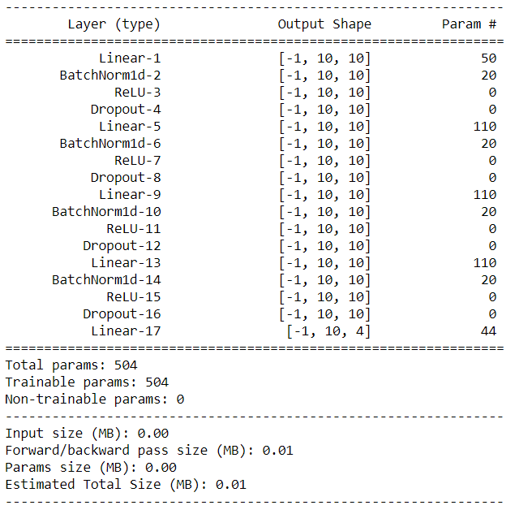

# HW3 readme

電機所 碩一 N26091194 鄧立昌

## Outline

[TOC]

## Intro

本目錄包含兩支程式:

1. NN.ipynb: 使用 pytotch 建立 Neural Networks
2. DecisionTree.ipynb: 使用 sklearn 建立 Decision Tree

最後預測結果為 "predict.txt"，結果如下所示:


## Decision Tree method

### Experiments

#### Exp 1

1. Change numeric data to categorical data
   - age < 25: 0
   - 25 <= age < 50: 1
   - 50 <+ age < 75: 2
   - 5 <= age: 3

```cmd
Train acc: 0.7230142566191446
Validation acc: 0.7014218009478673
```


#### Exp 2

1. Raw data (Numeric data)

```cmd
Train acc: 0.945010183299389
Validation acc: 0.5023696682464455
```


#### Exp 3

1. Raw data (Numeric data)
2. Normalize Features

```cmd
Train acc: 0.945010183299389
Validation acc: 0.5165876777251185
```


## NN method

### Model Architecture

```python
class NN(nn.Module):
    def __init__(self, input_dim, hidden_dim, droprate, num_class):
        super(NN, self).__init__()

        self.input_dim = input_dim
        self.hidden_dim = hidden_dim
        self.droprate = droprate
        self.num_class = num_class

        self.feature = nn.Sequential(
            #0
            nn.Linear(self.input_dim, self.hidden_dim),
            nn.BatchNorm1d(self.hidden_dim),
            nn.ReLU(),
            nn.Dropout(p=self.droprate),
            #1
            nn.Linear(self.hidden_dim, self.hidden_dim),
            nn.BatchNorm1d(self.hidden_dim),
            nn.ReLU(),
            nn.Dropout(p=self.droprate),
            #2
            nn.Linear(self.hidden_dim, self.hidden_dim),
            nn.BatchNorm1d(self.hidden_dim),
            nn.ReLU(),
            nn.Dropout(p=self.droprate),
            #3
            nn.Linear(self.hidden_dim, self.hidden_dim),
            nn.BatchNorm1d(self.hidden_dim),
            nn.ReLU(),
            nn.Dropout(p=self.droprate),
            #
            nn.Linear(self.hidden_dim, self.num_class),
        )

    def forward(self, x):
        x = self.feature(x)
        x = x.squeeze()
        return x
```



### Experiment

#### Exp 1

1. Normalize Features to range [-1,1]
2. Cross entropy with weight
3. He initialization

**Hyperparameters:**

1. optimizer: Adam
2. learning rate: 5e-3
3. scheduler: ReduceLROnPlateau(optimizer, 'min', patience=10, factor=0.1)
4. batch size: 32
5. loss function: CrossEntropy

**Results:**


#### Exp 2

1. Normalize Features to range [-1,1]
2. Cross entropy **without** weight
3. He initialization

**Hyperparameters:**

1. optimizer: Adam
2. learning rate: 5e-3
3. scheduler: ReduceLROnPlateau(optimizer, 'min', patience=10, factor=0.1)
4. batch size: 32
5. loss function: CrossEntropy

**Results:**


#### Exp 3

1. Normalize Features to range [-1,1]
2. Cross entropy **without** weight
3. He initialization

**Hyperparameters:**

1. optimizer: RMSprop
2. learning rate: 5e-3
3. scheduler: ReduceLROnPlateau(optimizer, 'min', patience=10, factor=0.1)
4. batch size: 32
5. loss function: CrossEntropy

**Results:**


#### Exp 4

1. With out Normalize Features
2. Cross entropy **without** weight
3. He initialization

**Hyperparameters:**

1. optimizer: AdamW
2. learning rate: 5e-3
3. scheduler: ReduceLROnPlateau(optimizer, 'min', patience=10, factor=0.1)
4. batch size: 32
5. loss function: CrossEntropy

**Results:**


#### Exp 5

1. With out Normalize Features
2. Cross entropy with weight
3. He initialization

**Hyperparameters:**

1. optimizer: AdamW
2. learning rate: 5e-3
3. scheduler: ReduceLROnPlateau(optimizer, 'min', patience=10, factor=0.1)
4. batch size: 32
5. loss function: CrossEntropy

**Results:**


#### Exp 6

1. Change numeric data to categorical data
   - age < 25: 0
   - 25 <= age < 50: 1
   - 50 <+ age < 75: 2
   - 5 <= age: 3
2. Cross entropy **without** weight
3. He initialization

**Hyperparameters:**

1. optimizer: AdamW
2. learning rate: 5e-3
3. scheduler: ReduceLROnPlateau(optimizer, 'min', patience=10, factor=0.1)
4. batch size: 32
5. loss function: CrossEntropy

**Results:**


