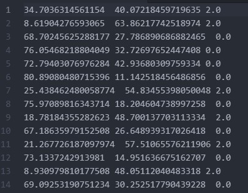

# Readme

電機所 碩一 N26091194 鄧立昌

## introduction

本程式使用 *k-means* 方法進行分群，
目錄中應包含:

1. output/
2. input/
3. pics/
4. k-means.ipynb

## Execute

使用 jupyter notebook 或是其他支援 ipynb 的環境 (vs code)，
開啟 k-means.ipynb 執行全部的 cell 即可。

##  Result

執行後會在 output 資料匣輸出結果。

**output:**

